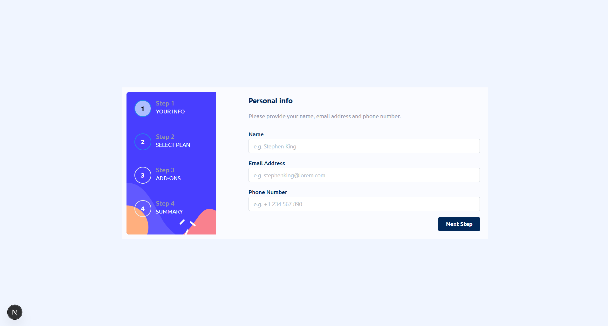

# Frontend Mentor - Multi-step form solution

This is a solution to the [Multi-step form challenge on Frontend Mentor](https://www.frontendmentor.io/challenges/multistep-form-YVAnSdqQBJ). Frontend Mentor challenges help you improve your coding skills by building realistic projects. 

- [Overview](#overview)
  - [The challenge](#the-challenge)
  - [Screenshot](#screenshot)
  - [Links](#links)
- [My process](#my-process)
  - [Built with](#built-with)
  - [What I learned](#what-i-learned)
- [Author](#author)
- [Acknowledgments](#acknowledgments)

## Overview

### The challenge

Users should be able to:

- Complete each step of the sequence
- Go back to a previous step to update their selections
- See a summary of their selections on the final step and confirm their order
- View the optimal layout for the interface depending on their device's screen size
- See hover and focus states for all interactive elements on the page
- Receive form validation messages if:
  - A field has been missed
  - The email address is not formatted correctly
  - A step is submitted, but no selection has been made

### Screenshot

### Links

- Solution URL: https://github.com/Fanu-Cd/frontend-mentor-multistep-form
- Live Site URL: 'https://frontend-mentor-multistep-form-omega.vercel.app/'

### My process

### Built with

- Semantic HTML5 markup
- CSS custom properties
- Flexbox
- CSS Grid-HTM
- Mobile-first workflow
- [React](https://reactjs.org/) - JS library
- [Next.js](https://nextjs.org/) - React framework
- [Tailwindcss](https://tailwindcss.com/) - CSS Framework
- [Mantine UI](https://mantine.dev/) - UI Library
- [Vite](https://vite.dev/) - Build tool

### What I learned

What I Learned While I Implemented the multistep form

- Leveraged Mantine Stepper to structure a clear, responsive multistep flow with custom layouts
- Fine-tuned form state management across steps, ensuring a smooth UX with dynamic validations and error handling
- Applied conditional logic to enable/disable steps and navigation based on user input
- Mastered how to persist form data when navigating between steps without unmounting components
- Implemented responsive, mobile-friendly design using Mantine’s Grid, MediaQuery, and layout primitives
- Enhanced UX with hover, focus, and active states across all interactive components
- Created a final review step that summarizes selections and confirms user intent before submission
- Handled form validation and error feedback in a user-friendly way (e.g. missing fields, invalid email formats)
- Ensured a smooth step transition experience, avoiding full rerenders using efficient state and layout management

## Author

- Website - [Fanuel Amare](http://fanuel-amare-personal-portfolio-v2.vercel.app/)
- Frontend Mentor - [@Fanu-Cd](https://www.frontendmentor.io/profile/Fanu-Cd)
